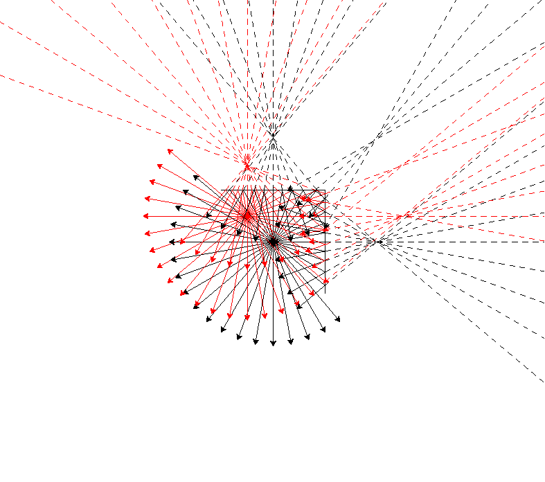

# Ray Reflection Simulation

***Zewail City of Science and Technology CSCI 101 (Introduction to Computer Science) Project***



This Python project simulates the reflection of rays of light off mirrors using the turtle graphics library. The simulation is customizable through initial conditions provided in a JSON file, allowing users to explore different scenarios of ray reflection.

## Features

- **Customizable Initial Conditions**: The simulation takes initial conditions such as mirror positions, light sources, angles, and iterations from a JSON file. Users can easily modify these conditions to create various simulation scenarios.

- **Turtle Graphics Visualization**: The simulation is visualized using the turtle graphics library, providing an interactive and graphical representation of ray reflection.

- **Image and Video Output**: Users can save the simulation results as images or videos. The script supports the creation of videos by compiling individual frames or generating static images.

## Getting Started

### Prerequisites

- Python 3.x
- Required Python libraries: Pillow (PIL), OpenCV (cv2), rich, turtle
  ```bash
  pip install Pillow opencv-python rich turtle
  ```

### Usage

1. Clone the repository:
   ```bash
   git clone https://github.com/salastro/ReflectoRay.git
   cd ReflectoRay
   ```

2. Run the simulation:
   ```bash
   python reflectoray.py [initial_conditions_file] [-i output_image] [-v output_video]
   ```

   - `[initial_conditions_file]`: Path to the JSON file containing initial conditions (default: `initial_conditions.json`).
   - `[-i output_image]`: Optional argument to save the simulation as a PNG image.
   - `[-v output_video]`: Optional argument to record the simulation as a video.

3. Explore the simulation and view the results.

## Customization

- Modify the `initial_conditions.json` file to adjust the simulation parameters, including mirror positions, light sources, angles, and iterations.

## Examples

1. Run the simulation with default initial conditions:
   ```bash
   python reflectoray.py
   ```

2. Customize the initial conditions and save the simulation as an image:
   ```bash
   python reflectoray.py my_conditions.json -i simulation_result.png
   ```

3. Record the simulation as a video:
   ```bash
   python reflectoray.py -v simulation_result.mp4
   ```

## Contributing

If you'd like to contribute to the project, please follow the [contributing guidelines](CONTRIBUTING.md).

## License

This project is licensed under the MIT License - see the [LICENSE](LICENSE) file for details.
